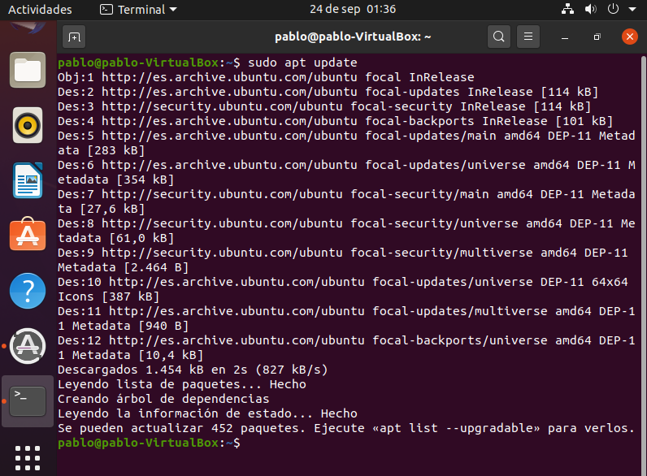
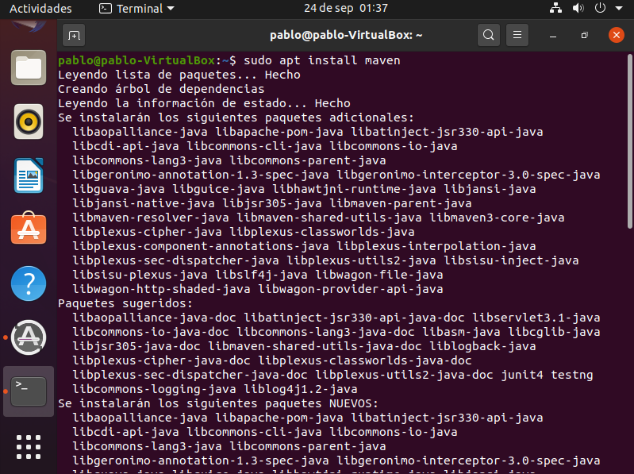
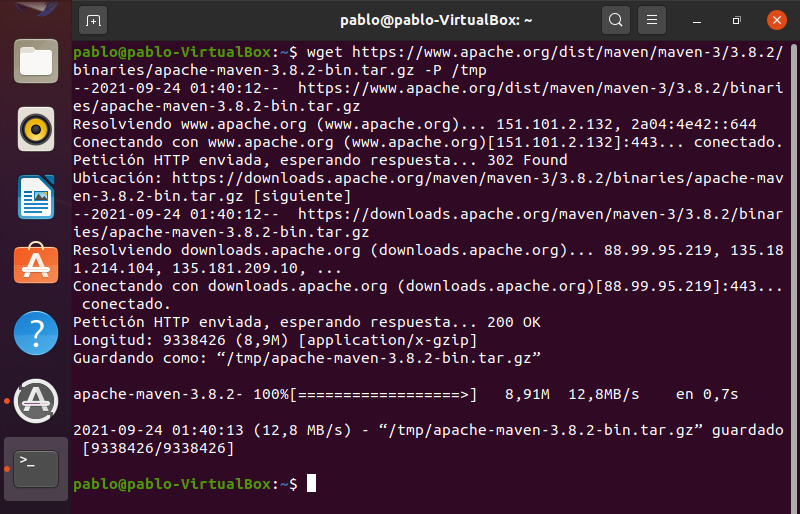
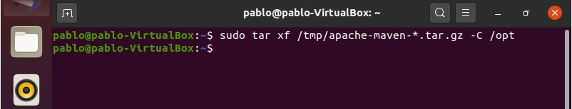
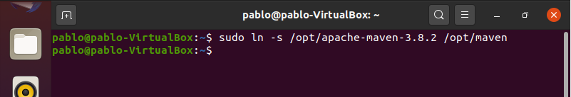
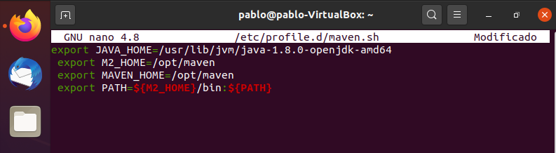
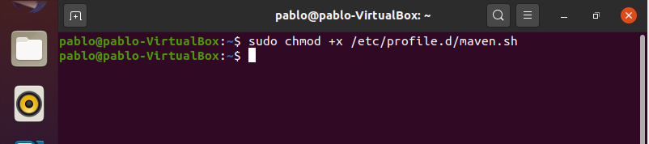
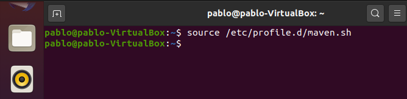
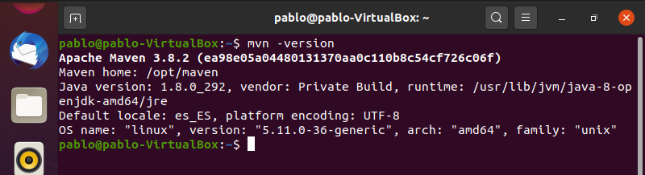

# Instalación de Maven en el SO
## Indice
- **[1. Instalación](#instalación)**
- **[2. Instalación de una versión concreta de Maven](#instalación-de-una-versión-concreta-de-maven)**
- **[3. Variables de Entorno](#variables-de-entorno)**
### Instalación

Para esta práctica necesitaremos instalar la herramienta Apache Maven en nuestra máquina virtual de Ubuntu. Tendremos que seguir una serie de pasos para realizar la instalación, primero de todo actualizaremos el sistema mediante el siguiente comando: **“sudo apt update”**.

Seguidamente de esto comenzaremos a instalar la herramienta Maven: **“sudo apt install maven”**.

Cuando se haya terminado de instalar comprobaremos la versión que se ha instalado, esto con el comando : **“mvn -version”**.

### Instalación de una versión concreta de Maven

A continuación, instalaremos de nuevo Marven, sin embargo, esta vez seleccionaremos una versión que nosotros mismo elegiremos. Para comenzar descargaremos Marven en el directorio /tmp: **“wget https://www.apache.org/dist/maven/maven-3/3.8.2/binaries/apache-maven-3.8.2-bin.tar.gz -P /tmp”**.

Luego, al terminar la descarga extraemos el archivo que se exportará en el directorio /opt con el siguiente comando: **“sudo tar xf /tmp/apache-maven-*.tar.gz -C /opt”**.

Ahora crearemos un enlace simbólico en el directorio de instalación de Maven, de esta manera cada vez que salga una nueva versión actualiza la instalación de Maven desempaquetando la última versión y cambiando el enlace simbólico para señalarla: **“sudo ln -s /opt/apache-maven-3.8.2 /opt/maven”**.

### Variables de entorno

Finalmente estableceremos las variables de entorno en el archivo mavenenv.sh, para ello usaremos el comando nano para poder editar el archivo: **“sudo nano /etc/profile.d/maven.sh”**.

Al guardar y salir haremos que el archivo recientemente editado tenga permisos de ejecución para ello usaremos el siguiente comando: **“sudo chmod +x /etc/profile.d/maven.sh”**.

Ya para acabar cargaremos las variables mediante el comando: **“source /etc/profile.d/maven.sh”**.

Para saber la versión de maven que se ha instalado usaremos, como ya anteriormente hemos usado, el comando: **“mvn -version”**.

